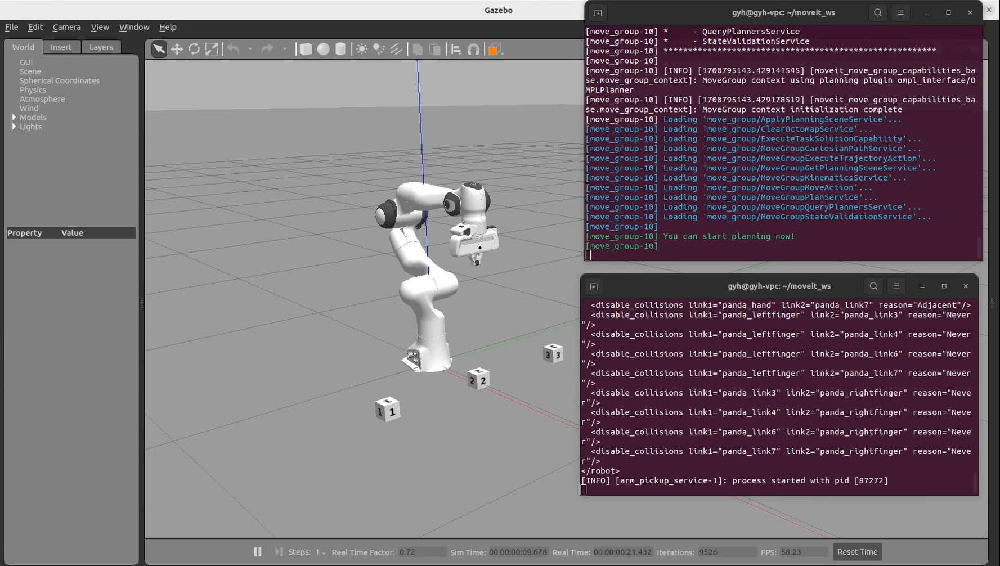

# sim_arm_pickup_demo

# 概述

该功能包通过接收用户请求，控制机械臂夹取目标物体。包含以下几个功能包：

1. sim_arm_panda_gazebo：仿真机械臂的gazebo环境以及moveit2控制相关的参数，[参考功能包](https://github.com/IFRA-Cranfield/ros2_RobotSimulation/tree/humble)进行了裁剪和优化
2. sim_arm_pickup_control：控制仿真机械臂拾取物体
3. sim_arm_location_msg：定义仿真机械臂拾取功能中所需的服务
4. gazebo-pkgs：gazebo仿真中机械臂夹取修复插件，[源码链接](https://github.com/JenniferBuehler/gazebo-pkgs/tree/humble)

# 使用方法

## 准备工作

1. 安装ros2-humble，gazebo方法此处不展开

2. 安装杂项，[参考链接](https://moveit.picknik.ai/humble/doc/tutorials/getting_started/getting_started.html)

```shell

#安装rosdep
sudo apt install python3-rosdep

#确保拥有最新的软件包
sudo rosdep init
rosdep update
sudo apt update
sudo apt dist-upgrade

#安装colcon
sudo apt install python3-colcon-common-extensions
sudo apt install python3-colcon-mixin
colcon mixin add default https://raw.githubusercontent.com/colcon/colcon-mixin-repository/master/index.yaml
colcon mixin update default

#安装vcstool
sudo apt install python3-vcstool

#安装其他功能包
sudo apt install ros-humble-ros2-control ros-humble-ros2-controllers ros-humble-gripper-controllers gazebo ros-humble-gazebo-ros2-control ros-humble-gazebo-ros-pkgs ros-humble-xacro
```

3. 下载源码并编译

```shell
#创建工作空间
mkdir -p ~/moveit2_ws/src

#下载moveit2源码
cd ~/moveit2_ws/src
git clone -b humble https://github.com/ros-planning/moveit2_tutorials
vcs import < moveit2_tutorials/moveit2_tutorials.repos

#下载sim_arm_pickup_demo源码
git https://github.com/wunuo1/sim_arm_pickup_demo.git

#检查依赖项
sudo apt update && rosdep install -r --from-paths . --ignore-src --rosdistro $ROS_DISTRO -y

#编译（时间会比较久，耐心等待）
cd ~/moveit2_ws
colcon build --mixin release
```

## 运行

```shell
#启动机械臂仿真环境（出现“You can start planning now!”后启动其他功能）
source ~/moveit2_ws/install/setup.bash
ros2 launch panda_ros2_moveit2 panda.launch.py

#打开新的终端，启动机械臂控制节点（该节点接收请求后才会进行抓取，请配合NodeHub的机械臂物体拾取功能一起使用）
source ~/moveit2_ws/install/setup.bash
ros2 launch sim_arm_pickup_control arm_pickup_service.launch.py

#也可以运行测试节点，将会抓取launch脚本中指定位置的物体
source ~/moveit2_ws/install/setup.bash
ros2 launch sim_arm_pickup_control arm_pickup_test.launch.py
```


